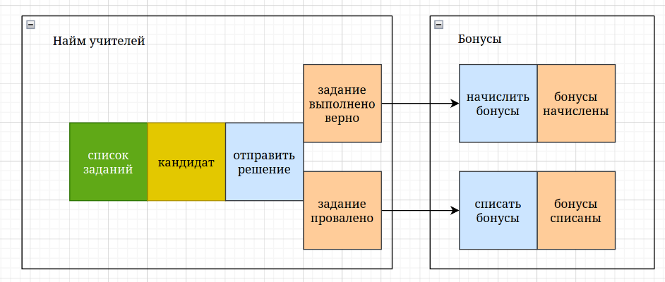
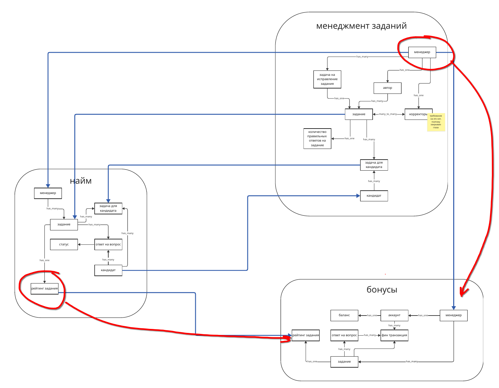
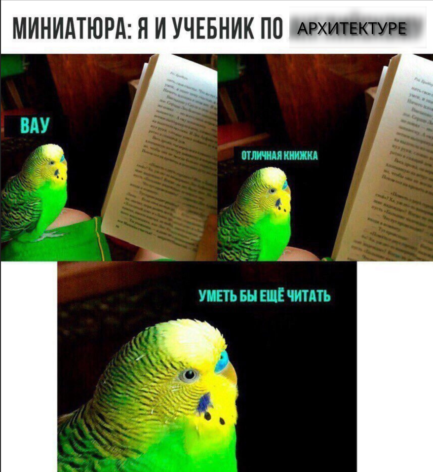

# Task 1
## Опишите ADR, который проиллюстрирует причину изменения любой из коммуникаций. Коммуникацию можно выбрать любую из тех, которые вы мигрировали в третьем уроке.
### ADR
#### Title: ADR-0001
Исправляем eventual consistency между сервисами найма и начислением бонусов.

#### Status
Proposed  

#### Context  
На момент принятия решения бизнес планировал начислять бонусы менеджерам сразу, как кандидат правильно выполнил задание. С точки зрения system function данное поведение выглядело следующим образом.
  

При этом, чтобы бизнес-логика работала, необходим один набор сущностей, которые были определены в system form: менеджер и рейтинг задания.
  

На момент принятия решения в тот момент, когда кандидат отпарвлял выполненный урок, сервис найма отправлял асинхронное событие TaskRating. К сожалению, у бизнеса возникли проблемы с такой реализацией коммуникации, которые выглядели так:  

[Problem-030] Логика начисления бонусов некорректна из-за ошибки с рейтингом задания. Во время начисления бонусов во время изменения рейтинга, происходит задержка, которая не удовлетворяет бизнес (нужно моментально).  
[Problem-040] Медленно начисляются бонусы менеджерам, потому что много кандидатов в учителя. Иногда вся система падает и не восстанавливается.  
[Problem-070] Менеджерам иногда начисляются бонусы дважды. Это связано с тем, что, когда кандидаты в учителя отправляют то же самое задание повторно, система тупит [Problem-050]. Разработчики объясняют тем, что управление заданиями падает, а бонусами — нет. Из-за этого бонусы попадают в два одинаковых запроса.  

#### Decision  
Единственный способ решить проблему перехода с eventual consistency на strong consistency — перевести связь с асинхронной на синхронную. Так как синхронная связь может быть только request-response, то остаётся выбрать способ имплементации в коде.

В нашем проекте для коммуникации между сервисами используются http-вызовы. Следовательно, асинхронное событие TaskRating будет заменено на синхронный http-вызов.

#### Consequenses
##### Плюсы

- бонусы начисляются сразу, без разграничения по времени.

- исчезают рассинхронизованные сценарии и редкие дубли начислений.

- в случае сбоя HTTP-запроса мы сразу сможем принять меры (retry, fallback), а не потерять отправленно событие

##### Минусы

- увеличение связанности между сервисами (хотя на данный момент она и так высокая)

- при увеличении нагрузки на сервис найма из-за большого количества кандидатов и последующем его масштабировании необходимо следить за нагрузкой сервиса начисления бонусов

- настроить правильный мониторинг и алертинг для своевременного реагирования на повышение нагрузки

- добавить механизм ретраев и таймаутов для синхронный запросов в сервис найма

#### Additional info
##### Compliance

TBD
##### Notes

TBD
##### Alternatives
TBD  
# Task 2
## Опишите, как почему возникла каждая из 10 проблем, которая возникла у бизнеса и как она будет решаться. Можно заполнить все таблицей

| Название проблемы | Из-за чего возникла проблема | Как проблема решилась |
| ----------------- | ---------------------------- | --------------------- |
| [Problem-010]    |                              |                       |
| [Problem-020]    |проблема возникла из-за неконсистентности в заданиях                              |назначение менеджера на переработку задания теперь осущесвтляется в сервисе менеджмента, поэтому не нужны [COMM-010, COMM-030] конкретно для этой операции -> нет задержек и фейлов в этих связях, обновленные задания отправляются в найм синхронно, логика подсчета успешно выполненных заданий в ряд хранится в сервисе менеджмента на основе бизнес события из найма "задание решено верно"                     , правда я пока не понял как решилась пробелма того, что основная задержка здесь в реакции менеджеров на изменение задания|
| [Problem-030]    |лаг в обработке асинхронного события `TaskRating`, неконсистентность информации о задании                              |расчет бонусов за верно решенное задание производится в сервисе бонусов на основе синхронного стриминга рейтинга задания из найма, стриминг задания производится из одного источника - менеджмента заданий                       |
| [Problem-040]    |предположительно из-за того же, плюс сильный каплинг через синхронные связи с остальной системой [COMM-070, COMM-080]                              |синхронный стриминг рейтинга задания - повысил скорость начисления бонуса менеджерам, асинхронный стриминг менеджеров и событий о созданном задании уменьшил каплинг и повысил стабильность системы                       |
| [Problem-050]    |синхронные вызовы [COMM-040, COMM-050, COMM-030, 090, 010]                              |при отправке задания на проверку нет необходимости в синхронных вызовах в сервис найма для назначения менеджеров на переработку задания(в случае верного решения) и списка самих менеджеров; из менеджмента теперь настроен асинхронный стриминг менеджеров, заданий. из найма в менеджемент стриминг кандидатов и ивентов об успешно выполненных заданиях. тем самым уменьшен каплинг и нет влияния на действие пользователя в UI, т.к. нет синхронных связей. отправил и забыл                       |
| [Problem-060]    |из-за наличия синхронных связей с остальными сервисами системы нагрузка перетекалась и на них                              |исходящие события из сервиса найма теперь обрабатываются асинхронно, а существующий синхронный стриминг рейтинга задания не предполагает высокой нагрузки на сервис бонусов, т.к. нам важно просто принять эти данные, а испльзоваться они будут при обработке асинхронного ивента с результатами решения. улучшено observability и алертинг, понятно как нужно скейлить                       |
| [Problem-070]    |cm. [Problem-030, 050]                              |                       |
| [Problem-080]    |cm [Problem-060]                              |                       |
| [Problem-090]    |отсутствие adr, docs, observability                              |описание adr, проекций системы, документации и обсёрвабилити (не удержался)                       |
| [Problem-100]    |кажется, что тут сдвг взяло верх и я больше не могу, но я бился как лев львиный                              |ушел подбирать мемы                       |

# Task 3 memes
  
  
  

