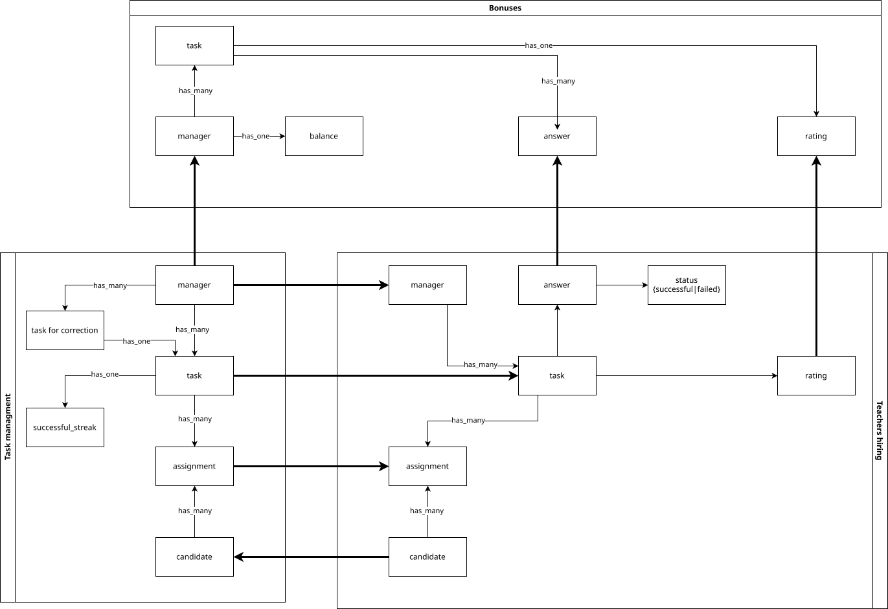
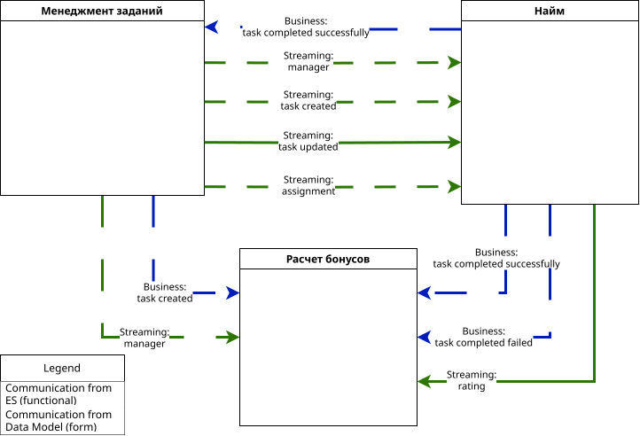

# Задание  
1. Сделайте концептуальную модель данных.
2. Сделайте общую модель формальных и функциональных связей.
3. Найдите места, в которых нужно поменять связи с синхронных на асинхронные. Пока ничего менять не нужно, этим займётесь в следующем уроке.
4. Опишите, как после этого изменятся связи. Какие из проблем бизнеса решатся (из описанных в списке выше) и почему вы решили изменить существующую связь. Чтобы было проще, возьмите шаблон таблицы.
5. Напишите название всех топиков и события, которые будут в топиках.

## Conceptual scheme

## Communication diagram

## Места, где нужно поменять связи  

| Номер связи | Как сделана связь на текущий момент | Как изменилась связь после первого урока | Какая теперь будет связь после второго урока | Номера проблем бизнеса которые, потенциально решатся | Почему связь необходимо изменить |
|-------------|-------------------------------------|-------------------------------------------|------------------------------------------------|-----------------------------------------------------|-----------------------------------|
| COMM-010    | HTTP                                    | убрать                                           | по прежнему не понятно зачем эта связь вообще существует                                               |[Problem-040][Problem-060][Problem-080]                                                     |сервису выполнения заданий не нужно знать ничего про менеджера, я бы ее вообще убрал. Уменьшим каплинг - увеличим avaliablity, reliability, performance, scaliablity          |
| COMM-020    |HTTP                                     | была путаница с неймингом сервисов, я думал, что сервис найма - внешний сервис в котором мы продаем задаине                                           | async событие из сервиса менеджмента с информацией о кандидате и назначенном ему задании                                                |[Problem-080][Problem-020][Problem-060]                                                     |                                   |
| COMM-030    |HTTP                                     |async                                           |async event driven                                                | [Problem-080][Problem-050][Problem-020][Problem-010]                                                     |уменьшит зависимость сервиса найма от сервиса менеджмента заданий, теперь созадется событие со стороны найма, что задание выполнено верно, а сервис менеджмента назначает менеджера на переделку, при получении такого события в соотвествии с полиси: если решено 10 раз подряд верно                                   |
| COMM-040    |HTTP                                     |   async                                        |sync request-response                                                |[Problem-080][Problem-030][Problem-040][Problem-050][Problem-070]| нужно моментально обновлять данные по балансу согласно требованиям, для этого подходит  |
| COMM-050    |HTTP                                     |аналогично                                           |  аналогично                                              |аналогично                                                     |                                   |
| COMM-060    |async event TaskRating |                                           |                                                |                                                     |                                   |не разобрался
| COMM-070    |HTTP                                     |убрать, добавить событие о появление нового менеджера                                           |same                                                |[Problem-030][Problem-040][Problem-070][Problem-80]                                                     |уменьшить каплинг и количество блокирующих вызовов, которые ведут к [Problem-080]                                   |
| COMM-080    |    HTTP                                 |async                                           |async                                                |[Problem-080][Problem-090]                                                     |добавляем событие, что задание создано, уменьшаем каплинг и блокирующие вызовы|
| COMM-090    |        HTTP                             |затруднился ответить                                           |по прежнему не уверен, но думаю, что вызов должен остаться синхронным, может не по http                                                |                                                     |                                   |

## Названия топиков и события  

| Название очереди/топика               | События и номера связи                                    | Почему эти события попали в топик                                                                                                                                                              | Почему так назвали                                                                                                                                                |
|---------------------------------------|-----------------------------------------------------------|------------------------------------------------------------------------------------------------------------------------------------------------------------------------------------------------|------------------------------------------------------------------------------------------------------------------------------------------------------------------|
| data_replication.managers             | create, update, delete [COMM-010][COMM-070][?COMM-030?]    | нам необходим стриминг менеджеров — событий не много, можно писать всё в один топик                                                                                                            | формальная связь для стриминга менеджеров                                                                                                                         |
| data_replication.candidates           | create, update, delete? [COMM-090]                        |                                                                                                                                                                                                | формальная связь для стриминга кандидатов                                                                                                                         |
| data_replication.lessons.created      | create [COMM-020][COMM-080]                               | к созданному заданию нет требований по скорости доставки потребителям; апдейты будут доставляться синхронно, поэтому здесь только created                                                     | формальная связь для стриминга созданных заданий                                                                                                                  |
| data_replication.candidate_assingment |                                                           | формальная связь для стриминга назначений задания на кандидата; в имени топика использовано «candidate» + «assignment», чтобы не спутать с назначением задачи менеджером на переделку         |                                                                                                                                                                  |
| domain.task_management                | [COMM-070][COMM-080]                                      |                                                                                                                                                                                                |                                                                                                                                                                  |
| domain.hiring                         | taskSolved, taskFailed [COMM-030][COMM-040][COMM-050]     | скорее это одно событие taskSolved, но с разными статусами (success и failed)                                                                                                                  | потому что это функциональная связь в контексте сервиса найма                                                                                                      |
| domain.bonuses_and_fees               |                                                           | да вроде не надо ничего                                                                                                                                                                        |                                                                                                                                                                  |

## Mемасы после проверки

