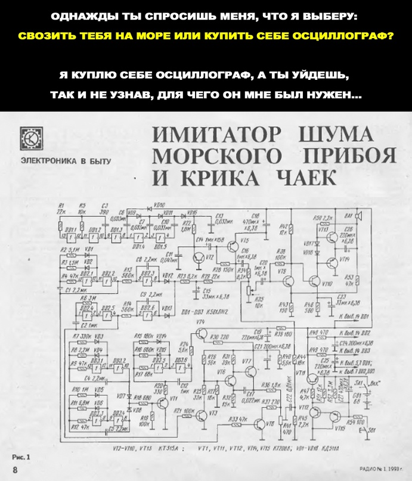

# Задания для домашки:

## Опишите схему события в формате json schema для любого формального и функционального события. На выходе у вас должно получиться две схемы. Если не хотите использовать json schema, можно взять avro.

### Формальное событие. Стриминг заданий для кандидата

```
JSON Schema

{
    "$schema": "https://json-schema.org/schema/task",
     "$id": "https://example.com/task.schema.json/v0",
    "title": "TaskCreated.v0",
    "description": "Initial json schema for task created formal event",

    "definitions": {
        "payload": {
            "type": "object",
            "properties": {
                "replication_id": {"type": "string"},
                "title": {"type": "string"},
                "author_replication_id": {"type": "string"},
                "task_text": {"type": "string"},
                "created_at": {"type": "string"},

                "steps": {
                    "type": "array",

                    "items": {
                        "type": "object",
                        "properties": {
                            "replication_id": {"type": "string"},
                            "author_replication_id": {"type": "string"},
                            "text": {"type": "string"},
                            "created_at": {"type": "string"},
                        },
                        "required": ["replication_id", "author_replication_id", "text", "created_at"],
                    }
                }
            },
            "required": ["replication_id", "title", "author_replication_id", "task_text", "created_at"]
        }
    },
    "type": "object",

    "properties": {
       "event_id": {"type": "string"},
        "event_version": {"enum": [0]},
        "event_name": {"enum": ["TaskCreated"]},
        "produced_at": {"type": "string"},

        "data": { "$ref": "#/definitions/event_data"}
    },
    
    "required": ["payload", "event_id", "event_version", "event_name", "produced_at"]
}
```

### Функциональное событие. Задание зарегистрировано.

```json
{
    "$schema": "https://json-schema.org/schema/task",
     "$id": "https://example.com/task.schema.json/v0",
    "title": "TaskRegistered.v0",
    "description": "Initial json schema for task registered fucntional event",

    "definitions": {
        "payload": {
            "type": "object",
            "properties": {
                "domain_id": {"type": "string"},
                "author_replication_id": {"type": "string"},
                "created_at": {"type": "string"},
            },
            "required": ["domain_id", "author_replication_id", "created_at"]
        }
    },
    "type": "object",

    "properties": {
       "event_id": {"type": "string"},
        "event_version": {"enum": [0]},
        "event_name": {"enum": ["TaskRegistered"]},
        "produced_at": {"type": "string"},

        "data": { "$ref": "#/definitions/event_data"}
    },
    
    "required": ["payload", "event_id", "event_version", "event_name", "produced_at"]
}
```

## Опишите процесс миграции четырёх связей. Если у вас нет связи с нужным условием, можно пропустить описание миграции:
### Переход формальной синхронной на асинхронную event-driven.

- добавить новое событие в schema registry
- добваить новый консьюмер, который будет сохранять логику sync обработчика
- добавить новый продьюсер, который будет отправлять событие валидное schema registry
- выключить синхронный вызов
- удостовериться, что все ок
- удалить признаки старого кода

### Переход формальной асинхронной event-driven на синхронную.

- выбрать стратегию pull/push для синхронной связи
#### Push

- добавить новый эндпоинт на стороне потребителя повторяющий логику асинхронной связи
- добавить синхронный вызов, выключить продьюсер
- удалить коньсюмер после обработки всех событий из старого топика
- почистить метрики, логи, доку и бд

### Переход функциональной синхронной на асинхронную event-driven.
- добавить новое событие в schema registry
- добавить стаб коньсюмера
- добавляем нового продьюсера
- проверяем, что все работает
- добавляем логику в консьюмер и выключаем sync обработчик
- чистим код

### Переход функциональной асинхронной event-driven на синхронную.
- добавить синхронный обработчик в потребителе
- добавить синхронный вызов и выключаем продьюсера
- ожидаем обработки оставшихся событий в топике
- вырезаем продьюсера и коньсьюмера


## UPDATED. Опишите процесс миграции одной формальной и одной функциональной связи для новых требований бизнеса. Стартовой точкой миграции стоит считать уже исправленную связь, т.е. если вы решили использовать формальную event-driven коммуникацию для передачи заданий — описывайте миграцию на новое требование сразу с асинхронной на асинхронную связь.
По итогу должно получиться два описания, одно для формальной или функцинальной связи касающейся [US-160] и одно для [US-170] (какую связь для какого требования выбрать — решайте на свое усмотрение).

### Новые требования

[US-160] Разбейте названия заданий [Knowledge Area] Title на knowledge area и title. Это нужно сделать во всех местах, где есть старое название.
[US-170] Необходимо анонимизировать информацию о менеджерах, чтобы агрессивные кандидаты не могли угрожать несчастным менеджерам.

#### Миграция версии асинхронной функциональной связи для [US-160]


рассматриваю только async событие о регистрации задания. 

- Добавляем колонку для хранения knowledge area в сервис менеджмента заданий
- Задеплоить версию сервиса менеджмента с новой миграцией схемы бд
- Написать обвязку для получения `title` на `knowledge area + title`. Если в значении `title` есть `knowledge area` задания, использовать новый код, если нет — оставить как есть
- В сервисе менеджмента заменить прямое получение `title` из бд на `old title` везде, где есть получение описания задания
- Добавляем schema registry и нулевую версию события
- Добавляем новую версию события в schema registry c `knowledge area`
- Добавляем колонки `knowledge area` во все потребители (в нашем случае только бонусы, т.к. найм работает по другому контракту в и топику на формальном уровне) 
- Применить миграции бд для бонусов (задеплоить, в случае если миграции хранятся вместе с сервисом)
- Перенести во всех сервисах консьюмеров данные в новую колонку `knowledge area` из `title` 
- Добавить логику разделения старой строки `title` на `title` и `knowledge area` на стороне всех консьюмеров
- Задеплоить все сервисы, где меняли консьюмер
- Добавляем новое событие в консьюмер и обработку в коде в зависимости от версии (выбираем путь, когда новый топик не создаем)
- Деплоим консьюмеров
- Добавляем отправку новой версии события из продюсера и удаляем отправку старого события
- Деплоим продьюсера
- Ждём, пока обработаются все события старой версии
- Удаляем лишний код в консьюмерах
- Чистим систему от старого события (архив схемы, логи, дашборды)

#### Миграция асинхронной формальной связи US-170


- Добавляем schema registry и нулевую версию события
- Добавляем новую версию события в schema registry c пометкой, что имя автора теперь deprecated, добавляем туда `replication_id` менеджера (если ещё не было)
- Добавляем колонки для хранения `author_id` во все потребители (найм и бонусы, хотя в них можно ничего не менять, т.к. кандидаты никак не видят эти данные из бонусов, но если мы в последствии уберем отправку имени, то стоит иметь на этот случай колонку), если таковых ещё нет
- Применить миграции бд для бонусов (задеплоить, в случае если миграции хранятся вместе с сервисом)
- Перенести во всех сервисах консьюмеров данные в новую колонку `author_id`
- Задеплоить все сервисы, где меняли консьюмер
- Добавляем новое событие в консьюмер и обработку в коде в зависимости от версии (выбираем путь, когда новый топик не создаем)
- Деплоим консьюмеров
- Добавляем отправку новой версии события из продюсера и удаляем отправку старого события
- Деплоим продьюсера
- Ждём, пока обработаются все события старой версии
- Добавляем логику отображения автора для кандидатов в сервис найма и деплоим
- Удаляем лишний код в консьюмерах
- Чистим систему от старого события (архив схемы, логи, дашборды)


## Подготовить описание способов решения проблем вокруг зачисления и списания средств, так как бизнес переживает что что-то пойдет не так и деньги потеряются. Нужно составить список подходов, которые помогут не потерять данные, объяснить почему именно эти подходы нужны и как будут обрабатываться ошибки в случае проблем.

### Проблемы продюсера. Сломался message broker, и продюсер перестал отправлять сообщения

#### Проблема 1. Нарушается транзакционность отправки событий

в данном случае, не переживаем за транзакционность отправки событий, потому что регистрация нового менеджера происходит атомарно, так же и регистрация им задания происходит атомарно. Плюс между регистрацией нового менеджера и созданием им задания пройдет достаточно времени, чтобы информация о менеджере среплицировалась в сервис бонусов. Таким образом, при начислении средств за созданное задание новым менеджером нужная информация для начисления бонусов и у нас уже будет в сервисе бонусов. Аналогично и со списаниями за неправильно выполненное задание  
**[Вопрос] P.S. смотрел разбор, там часто говорилось про то, что outbox не поможет. видимо как как раз про этот случай шла речь?**

#### Проблема 2. Данные не попадают в брокер  

Лечится ack и ретраями.
- `ack` можем добавить `one`. Только подтверждение от брокера лида, чтобы не замедлять сильно систему, т.к. у нас есть проблема от бизнеса [Problem-040]. Либо вообще убрать и справляться ретраями
- настроить exponential backoff и circuit braker с неким буффером для хранения запросов, которые не были отправлены в состоянии `OPEN`. Можно использовать `in-memory` или спец.таблицу в БД

### Проблемы консьюмера. Событие из брокера не читается

#### Проблема 1. Событие не пришло или пришло несколько одинаковых

Нам нельзя терять ивенты, которые ведут к зачислению/списанию средств, поэтому мы будем использовать:
- **at least once delivery** и доработкой в коде. из события будем хранить `event_id:produced_at` в любом хранилище и перед обработкой проверять обрабатывалось такое событее ранее или нет

#### Проблема 2. Событие не соответствует ожиданиям консьюмера

**[Вопрос]** честно слабо представляю примеры из урока, что в брокер может попасть другое событие или `type mismatch`. Как такое может быть?  
разве что кое-что забыл обновить версию схемы в консьюмере :smirk: 😏  

В любом случае такие данные нам терять нельзя, поэтому используем Dead Letter Queue, записывая невалидные события в отедльный топик и если таких событий много, то создаем отдельный консьюмер, если он уже выпелен, со старой версией контракта (я все ещё не могу представить, что нам может придти вообще полный булщит, а не просто какая-то досадная оплошность при миграции версий. Иначе тут просто какое-то GIGO, а чтобы его не было мы и пользуемся контрактами)

#### Проблема 3. Развалилась бизнес-логика на стороне консьюмера  

в нашем случае маловероятно, т.к. похоже на объяснение [вот тут](#### Проблема 2. Данные не попадают в брокер)  
разве что тут можно использовать DLQ в случае, если событие о выполненном задании из наймы пришло раньше события о регистрации задания в менеджменте
ну или я что-то не так понял

# memes  

для меня самая сложная домашка выдалась, поэтому в этот раз на мемы осталось мало сил  

  

